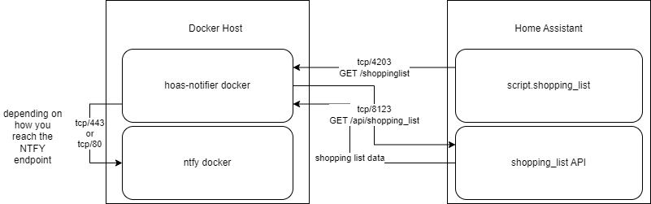

# hoas-shoppinglist-helper
A Home Assistant Shopping List notifier via ntfy service. because by default this functionality is not present in home assistant

This project provides a **single FastAPI endpoint** that:

1. Fetches your shopping list from Home Assistant (HA).
2. Filters out incomplete tasks.
3. Sends those tasks to an ntfy.sh endpoint.

Everything runs neatly in a Docker container that will be integrated via home-assistant.

Here is an high-level overview


## Features

- **FastAPI** for the web framework.
- **Docker** for easy deployment.
- **Environment variables** to store sensitive values (like HA token, URLs, etc.).
- **Simple single endpoint** to both fetch and send the tasks in one go.

## Prerequisites

- [Docker](https://docs.docker.com/get-docker/)
- Optionally, [Docker Compose](https://docs.docker.com/compose/install/) if you prefer Compose workflows.

## Directory Structure

You should have at least the following files:

```
.
├── Dockerfile
├── requirements.txt
├── app.py
└── docker-compose.yaml
```

## Getting Started

1. **Clone or download** this repository to your local machine.

2.  **Update** the `HA_URL`, `HA_TOKEN`, and `NTFY_URL` environment variables in the `docker-compose.yaml` file.

3. **Build** the Docker image:

   ```bash
   docker build -t hoas-shopping-list .
   ```

4. **Run** the Docker container:

   ```bash
   docker compose up -d
   ```

5. **Verify** the container is running:

   ```bash
   docker ps
   docker logs hoas-shopping-list
   ```

6. **Test** the FastAPI endpoint:

   ```bash
   curl -X POST http://localhost:4203/shoppinglist
   ```

   You should see a JSON response containing `{"status":"OK","message_sent":[ ... ]}` if everything went smoothly.

7. **integration with Home Assistant**

   Now that the API is up and running we should integrate this into home assistant.
   add the following code snippet to your configurations.yaml file

   ```yaml
   rest_command:
     trigger_http:
       url: "http://<ip-of-the-docker>:4203/shoppinglist"
       method: GET
   ```

   And we can use this in a script to trigger the http GET request.
   Go to scripts > add a script > enter YAML mode > paste the following

   ```yaml
   alias: Shopping_List
   sequence:
     - action: rest_command.trigger_http
       data: {}
   mode: single
   description: ""
   ```

   and now you can use this in an automation as `script.shopping_list`

## Troubleshooting

- If you get a `HTTPException(status_code=500, detail=...)`, check:
  - The environment variables are set properly.
  - That your Home Assistant and ntfy.sh endpoints are reachable from the Docker container’s network.
  - Your HA token is valid.

## Contributing

Feel free to open issues or pull requests if you have ideas to improve this setup!

---

Thanks for checking out this project. If you found it helpful, consider giving it a star on GitHub. Enjoy your Home Assistant automation and stay secure out there!
